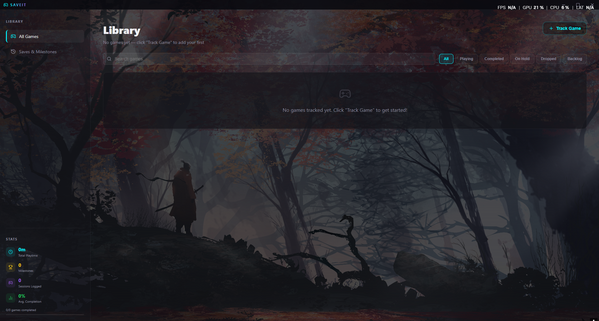
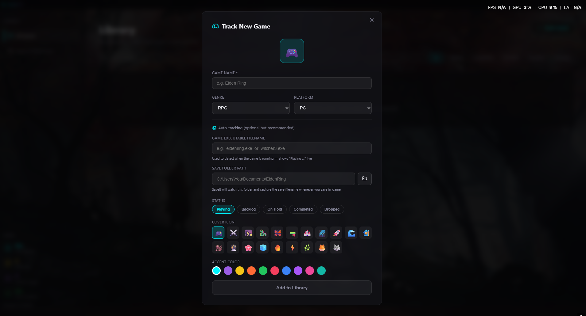
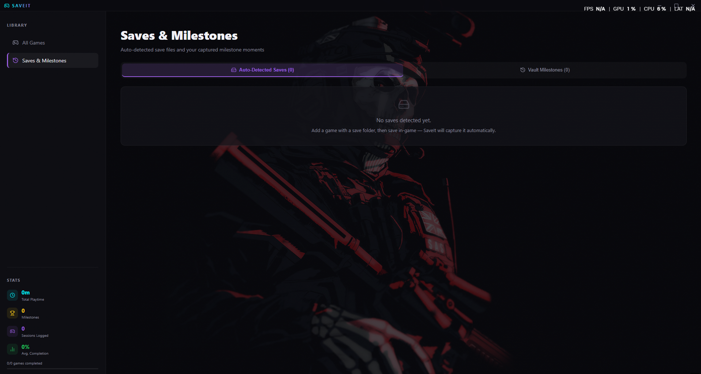
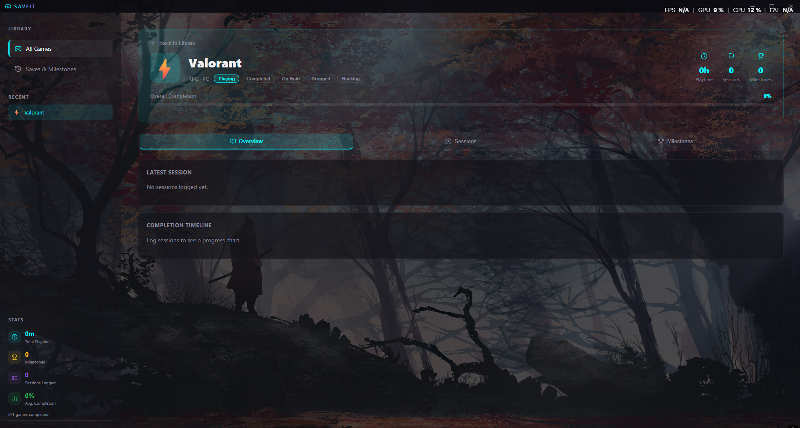

# Save-it 🎮

A Tauri desktop app for tracking your game progression — like Discord's activity status, but built into a full save manager.

## What it does

<p align="center">
  
</p>

- **Auto-detects games** you launch — shows a "Playing Elden Ring" banner without any setup
- **Watches your save folder** — the moment you save in-game, Save-it captures the exact save filename as a checkpoint
- **Tracks everything** — sessions, completion %, playtime, milestones, notes per run
- **Built-in game database** — 100+ games recognized automatically by their process names

## Screenshots

| Home | Track |
| :---: | :---: |
|  |  |

| Saves | Added Game |
| :---: | :---: |
|  |  |

## Stack

- **Frontend** — React + TypeScript + Vite + Framer Motion
- **Backend** — Rust (Tauri v2), sysinfo for process detection, notify for file watching
- **Storage** — SQLite (via rusqlite) + localStorage for UI state

## Getting started

```bash
npm install
npx tauri dev
```

> Requires [Rust](https://rustup.rs/) and the [Tauri prerequisites](https://tauri.app/start/prerequisites/) for your OS.

## Features

- 🎯 Discord-style "Now Playing" banner
- 📁 Save file auto-detection (watches Documents or any folder you point it at)
- 🏆 Manual milestone captures (Ctrl+Shift+S hotkey)
- 📊 Per-game sessions with completion % timeline
- 🔍 Search + filter your library by status
- 🌒 Dark gaming aesthetic with per-game accent colors

<p align="center">
  
</p>
